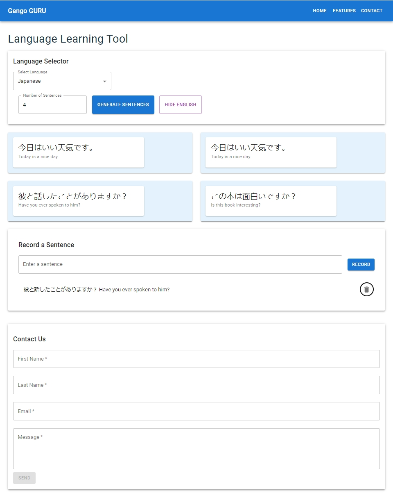

# Gengo Guru

## Introduction

**Gengo Guru** is a responsive mobile application designed as **a language learning tool that allows users to generate random sentences in the languages they want to learn**. The primary purpose of this application is to function like flashcards, helping users become familiar with random language sentences. Users can control the number of sentences they generate at a time and toggle translations on or off. 

The application utilizes Material-UI (MUI) libraries for a smooth and responsive user interface. 
https://mui.com/material-ui/getting-started/

## Final Version of the Project

The final iteration of Gengo Guru includes several key features and functionalities:
- **Language Selection**: A dropdown list allows users to select the language of the sentences.
- **Sentence Generation**: Users can type or select the number of sentences they wish to generate.
- **Toggle Translation**: Users can choose to show or hide translations, aiding in learning and retention.
- **Sentence Record**: Users can record sentences to track their learning progress.
- **Feedback Form**: A form for users to provide feedback, helping improve future versions of the app.
  
You can view the live application here: [https://zhengdong-uga.github.io/GengoGuru/]
  

## Achievements

I successfully implemented several features that enhance the learning experience:
- **Responsive Design**: Utilizing Material-UI, the app is responsive across various devices.
- **Interactive Learning Tools**: Including language selection, sentence generation, and translation toggling.
- **User Engagement Features**: Sentence recording and a feedback form allow for user interaction and improvement based on real user experiences.
These functionalities directly address the initial goals of creating an interactive and user-friendly language learning tool.

## Limitations and Challenges

Few challenges during the development were faced
1. **API Limitations**: Difficulty in finding a Japanese API that offers sentences rather than just words. I resorted to using static JSON files due to the unavailability of suitable APIs.
2. **Integration Issues**: Challenges in integrating the Google Translate API post-demo, which required further exploration and assistance.

## Struggles

During development, I encountered specific issues:
1. **Language Switch Bug**: A bug occurs where sentences display as blank when switching languages. This issue is currently under investigation.
2. **Single to Multi-page Transition**: Difficulty in evolving the app from a single-page to a multi-page setup, which remains an area for future development.

## Future Enhancements

Potential future enhancements include:
1. **Back-end Development**: Establishing a sentence database or integrating the Google Translate API successfully.
2. **Audio Integration**: Adding audio playback for sentences to aid in pronunciation and listening skills.
3. **Improved Sentence Recording**: Enhancing the sentence recording feature to include in-line options for adding sentences to a list or reminder.

## Conclusion

Developing Gengo Guru was a challenging yet rewarding experience. This project not only achieved the goals but also provided significant learning in app development and user interface design. We look forward to expanding its capabilities and reaching more users in the future.

## Project Structure

For grading purposes, please focus on the following files and directories:
- **`../src/App.jsx`**: The main component that integrates all parts of the application. It manages the state and handles the routing, ensuring that the user interface is dynamically updated as users interact with the application.

- **`../src/components/Controls.jsx`**: This component provides the user interface elements that allow users to select the language, choose the number of sentences, and toggle the translation visibility. It plays a key role in configuring how sentences are displayed and interacted with in the application.

- **`../src/components/SentenceDisplay.jsx`**: Responsible for displaying the generated sentences based on user selections. It interacts with the `Controls.jsx` to receive user inputs and displays sentences accordingly.

- **`../src/components/SentenceRecord.jsx`**: Manages the recording of sentences. This component allows users to save sentences they find useful into a record for later review, aiding in the learning process.

- **`../src/components/ContactForm.jsx`**: Handles user feedback through a simple form. This feedback is vital for gathering user insights and improving future versions of the application.

The JSON files `frenchSentences.json` and `japSentences.json` serve as the source for the sentence data, ensuring that users have access to quality content for language learning.

## Repo Template:
React + Vite

Currently, two official plugins are available:

- [@vitejs/plugin-react](https://github.com/vitejs/vite-plugin-react/blob/main/packages/plugin-react/README.md) uses [Babel](https://babeljs.io/) for Fast Refresh
- [@vitejs/plugin-react-swc](https://github.com/vitejs/vite-plugin-react-swc) uses [SWC](https://swc.rs/) for Fast Refresh
